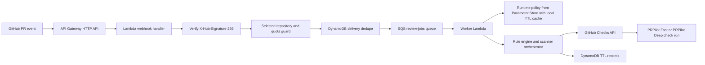
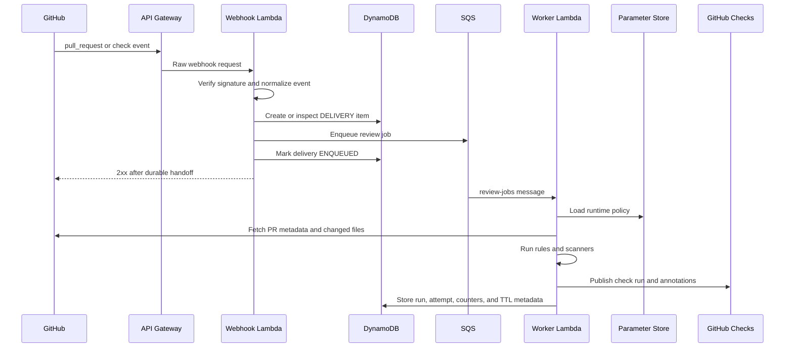

# PRPilot

This repository has been restored from a previously deleted repo to start fresh with a cleaner foundation. Prior development history is not reflected in the commit log

PRPilot is a self-hosted GitHub App that reviews pull requests before a human reviewer spends time on avoidable issues. The MVP is built for students and early-career developers who want fast, structured PR feedback inside GitHub, without turning the project into a SaaS or depending on paid AI tools. 

The main idea is simple. A private GitHub App receives pull request events, verifies that the request is real, checks whether the repository is allowed, deduplicates repeated deliveries, queues the work, runs deterministic review checks, and publishes a GitHub Check Run back to the pull request.

The required path is the fast lane. It is deterministic, low-cost, and designed to finish inside the normal PR flow. Deep scans exist in the architecture, but they are manual or opt-in by default and never change the required fast-lane result.

## What This Is

PRPilot is an open-source, self-hosted devtool. Each deployment owner runs their own private GitHub App in their own AWS account. The owner controls the GitHub App, AWS bill, logs, retained data, scanner policy, selected repositories, and runtime limits.

The first supported repository type is intentionally narrow. The required fast lane supports Node.js, TypeScript, and JavaScript repositories that have a root `package.json`, a root `package-lock.json`, and GitHub Actions workflows when workflow files are changed. Broader language support is deferred until the baseline system proves useful inside the budget and latency limits.

The project is not trying to be a dashboard, marketplace app, analytics platform, or always-on security scanner in the MVP. It is a focused PR review system that keeps merge-blocking decisions explainable and deterministic.

## Core Constraints

PRPilot is designed around a few constraints that shape the whole architecture.

| Constraint | Target |
| --- | --- |
| Webhook response time | Accepted deliveries must be acknowledged inside GitHub's 10 second delivery window |
| Normal PR completion time | Required check should complete under 60 seconds at p95 |
| Monthly cost target | 0 to 5 USD per self-hosted instance |
| Monthly hard cost ceiling | 10 USD unless the deployment owner explicitly approves more |
| Required check behavior | Deterministic and non-AI |
| Default scan path | Fast lane only |
| Deep scans | Disabled by default, manual or opt-in later |
| Secrets | Never hardcoded, loaded through env references or Parameter Store |
| Storage | Short retention with DynamoDB TTL |
| Scaling posture | Shed optional work before increasing infrastructure spend |

If PRPilot cannot complete an honest required review, it must publish an explicit operational result instead of pretending that the review passed.

## Architecture

The architecture is AWS-native and async by default. API Gateway and Lambda handle webhook ingress. SQS buffers review work. A worker Lambda runs the review logic. DynamoDB stores delivery state, run summaries, attempts, counters, and locks. Parameter Store holds runtime policy and secret references outside the code.



The webhook handler stays small on purpose. It verifies the signature, normalizes the payload, checks repository scope, handles delivery idempotency, writes the received state, hands the job to SQS, writes the enqueued state, then returns success only after durable handoff succeeds.

The worker owns the slower part. It loads current policy, checks the PR head SHA, resolves the lane, fetches the allowed inputs, runs the deterministic rules and scanners, normalizes findings, publishes the check, and stores short-lived review metadata.

## Data Flow



The important rule here is that GitHub only gets a success response after the job is safely handed off. If queue handoff fails, the webhook path must avoid a false 200 response.

## Tech Stack

| Layer | Technology | Why it is used |
| --- | --- | --- |
| Runtime | Node.js 22 and TypeScript | Main app language and AWS Lambda runtime |
| Ingress | API Gateway HTTP API and Lambda | Receives GitHub webhooks without running a server all the time |
| Worker | Lambda | Runs queued review work with bounded concurrency |
| Queue | Amazon SQS and dead-letter queue | Decouples webhook delivery from scanner execution and gives retry handling |
| Data store | DynamoDB with TTL | Stores idempotency, run metadata, attempts, counters, and locks with short retention |
| Secrets | AWS Systems Manager Parameter Store SecureString and KMS | Keeps webhook secret and private key outside the repo |
| Runtime policy | Standard Parameter Store document with local TTL cache | Lets the owner change budget mode, caps, selected repos, and mitigations without redeploy |
| Infrastructure | AWS CDK in TypeScript with `NodejsFunction` bundling | Defines Lambda, API Gateway, SQS, DynamoDB, IAM, alarms, TTL, and outputs |
| Package management | npm workspaces | Keeps apps and packages in one monorepo |
| Validation | Zod | Validates env vars, webhook normalization, runtime policy, and `.prpilot.yml` |
| GitHub API | `@octokit/app`, `@octokit/rest`, and `@octokit/webhooks` | Handles app authentication, webhook work, and Checks API publishing |
| Testing | Vitest and webhook fixtures | Tests core logic and integration seams |
| CI/CD | GitHub Actions with AWS OIDC | Runs checks and deploys without long-lived AWS credentials |
| Observability | CloudWatch Logs, low-cardinality Metrics, and minimal Alarms | Gives enough operational signal without paid-heavy dashboards |

Hono is listed as optional for ingress ergonomics, but the planned ingress default is a plain Lambda handler so raw-body signature verification stays explicit.

## Monorepo Shape

```text
root/
  apps/
    webhook/        Lambda webhook ingress
    worker/         SQS consumer and check publisher
    cli/            optional preflight CLI planned for P11
  packages/
    rules/          deterministic rule engine
    scanners/       scanner adapters and pack registry
    checks/         check-run conclusion and annotation publishing
    review-store/   DynamoDB persistence and idempotency helpers
    policy/         runtime policy and repository policy precedence
    github/         Octokit client helpers
    config/         env validation and parameter loading
    observability/  logging and low-cost metrics wrappers
  infra/            AWS CDK stacks
  tests/
    unit/
    integration/
    fixtures/
  codex-folder/codex/
  codex-folder/.codex/commands/
```

The CLI is planned later and is not required for the early repo proof.

## Core Modules

| Module | What it does | Main dependency |
| --- | --- | --- |
| `webhook-ingress` | Verifies webhook authenticity, normalizes the event, applies selected-repo and quota guards, then hands accepted work to the queue | GitHub signing secret, API Gateway request, runtime policy allowlist |
| `dedupe-guard` | Prevents duplicate or superseded delivery processing while allowing retries for deliveries stuck before queue handoff | DynamoDB |
| `rule-engine` | Evaluates deterministic review rules on changed files | PR file metadata and patch hunks |
| `scanner-orchestrator` | Runs the allowed scanner pack for the current budget mode, enforces timeout and annotation budgets, then normalizes outputs | Changed files, scanner registry, runtime policy |
| `check-publisher` | Creates or updates GitHub check runs, maps conclusions, caps annotations, and falls back to summary-only publishing | GitHub App installation token |
| `review-store` | Persists delivery lifecycle states, run metadata, finding summaries, timing data, and TTL fields | DynamoDB |
| `runtime-policy` | Loads owner controls for budget mode, selected repos, scanner availability, emergency disables, and quota controls without redeploy | Parameter Store and local TTL cache |

## Entry Points

| Entry point | Type | Purpose |
| --- | --- | --- |
| `POST /webhooks/github` | API trigger | Receives GitHub events, verifies signatures, applies scope and budget guards, then enqueues accepted jobs |
| `review-jobs` SQS message | Event trigger | Runs the worker path for queued review jobs |
| `check_suite.rerequested` | GitHub event | Reruns the fast lane when cooldown and quota policy allow it |
| `check_run.requested_action` | GitHub event | Requests the optional deep lane from a GitHub check button |
| `prpilot preflight` | Optional CLI | Runs local deterministic checks before push so deployed usage stays lower |
| `installation` and `installation_repositories` | Control-plane events | Update installation-scope state without running analysis |

## GitHub App Permissions

The app uses the smallest planned permission set for the MVP.

| Capability | Level | Why it exists |
| --- | --- | --- |
| Repository metadata | read | Identifies installation and repository context |
| Repository contents | read | Reads changed files, workflow files, support files, and `.prpilot.yml` |
| Pull requests | read | Fetches PR metadata, changed files, and head SHA |
| Checks | write | Creates and updates check runs |

The allowed webhook events are `pull_request`, `check_suite`, `check_run`, `installation`, and `installation_repositories`.

The pull request actions that can trigger review work are `opened`, `reopened`, `synchronize`, and `ready_for_review`.

## Security Model

Security is part of the required path, not a later polish step.

| Control | Planned behavior |
| --- | --- |
| Webhook authenticity | Enforce `X-Hub-Signature-256` before normalization or side effects |
| Invalid signatures | Reject safely and do not queue work |
| Delivery idempotency | Use `X-GitHub-Delivery` as the delivery key |
| Duplicate handling | Already enqueued, processing, or published deliveries do not run twice |
| Retryable handoff failure | A stale `RECEIVED` delivery without `ENQUEUED` becomes retryable |
| Repository scope | `selected_repository_ids` rejects out-of-scope repos before queue or processing side effects |
| Secrets | Stored outside the repo and referenced through env names or Parameter Store |
| CI cloud auth | OIDC only, no long-lived AWS credentials |
| Fork PR context | Must not depend only on `check_suite.pull_requests`, because that data can be incomplete |
| Required path | No merge-blocking decision depends on AI or paid-only tools |

## Normalized Webhook Event

The webhook handler turns raw GitHub payloads into one normalized shape before dedupe or queue handoff. Invalid or unsupported payloads fail before delivery state advances past `RECEIVED`.

| Field | Required | Meaning |
| --- | --- | --- |
| `delivery_id` | yes | `X-GitHub-Delivery` idempotency key |
| `event` | yes | GitHub event name such as `pull_request`, `check_suite`, or `check_run` |
| `action` | yes | GitHub webhook action |
| `installation_id` | yes | GitHub App installation identity |
| `repository_id` | yes | Numeric repository ID for selected-repo checks |
| `repository_full_name` | yes | `owner/repo` display name for logs and summaries |
| `pr_number` | yes for PR review work | Pull request number under review |
| `head_sha` | yes for PR review work | Exact commit SHA the job can inspect |
| `base_sha` | yes for PR review work | Base commit SHA for diff resolution |
| `sender_login` | yes when present | GitHub login that triggered the event |
| `requested_action_id` | only for `check_run.requested_action` | Manual deep-lane action identity |

## Delivery Lifecycle

The delivery state model is what keeps the app honest under retries and duplicate GitHub deliveries.

| State | Meaning |
| --- | --- |
| `RECEIVED` | Webhook was accepted far enough to record the delivery |
| `REJECTED` | Request was rejected before queue work |
| `DUPLICATE` | Delivery was already handled far enough to avoid side effects |
| `SUPERSEDED` | A newer SHA or lane job made this work stale |
| `ENQUEUED` | Work was durably handed to SQS |
| `PROCESSING` | Worker started the job |
| `PUBLISHED` | GitHub check result was published |
| `FAILED` | Processing failed after the allowed handling path |

`RECEIVED` without `ENQUEUED` after the handoff retry window is retryable. `ENQUEUED`, `PROCESSING`, and `PUBLISHED` are duplicates for side-effect purposes.

## Run Identity

Each logical review run is tied to a repo, PR, head SHA, and lane.

| Artifact | Identity |
| --- | --- |
| Logical review run | `repo_id`, `pr_number`, `head_sha`, `lane` |
| GitHub check `external_id` | `prpilot:{repo_id}:{pr_number}:{lane}:{head_sha}` |
| Queue job | `job_id`, `delivery_id`, `lane`, `repo_id`, `repository_full_name`, `installation_id`, `pr_number`, `head_sha`, `base_sha`, `trigger`, `attempt` |

A rerun increments attempt metadata but does not create a new logical run identity for the same lane and head SHA. A newer head SHA invalidates older queued or in-flight jobs before publish.

## Policy Precedence

Policy is resolved in this order.

1. Safety invariants always win. Signature verification, dedupe, required-path honesty, and hard runtime caps cannot be weakened by config.
2. Deployment-owner runtime policy comes next. Parameter Store controls budget mode, selected repositories, scanner availability, emergency disables, and hard ceilings.
3. Repository policy comes after that. `.prpilot.yml` can narrow scope, raise strictness, or opt into already-enabled deep checks, but it cannot exceed owner caps.
4. Environment defaults provide baseline values when runtime policy does not override them.

When repo policy and owner policy disagree, the stricter value wins.

## Runtime Policy

Runtime policy is deployment-owner configuration. It controls budget mode, selected repositories, quotas, annotation limits, scanner availability, and optional deep scans. In live AWS, the policy document lives in Parameter Store outside Lambda code and outside normal environment variables.

The loader has local TTL caching so Lambda does not fetch the policy on every small decision. Cached policy can only be used inside the configured TTL. When the cache expires, the runtime must refetch before admitting new work. If the owner policy cannot be loaded or validated, required-path execution fails closed instead of guessing.

The planned runtime policy contract includes these groups.

| Group | Fields |
| --- | --- |
| identity | `version`, `updated_at` |
| scope | `selected_repository_ids`, `max_installations`, `max_active_repos` |
| budgets | `budget_mode`, `fast_lane_budget_ms`, `deep_lane_budget_ms`, `annotation_cap`, `scanner_max_parallel` |
| quotas | `max_fast_runs_global_per_day`, `max_fast_runs_per_repo_per_day`, `max_manual_reruns_per_pr_per_day`, `max_deep_scans_per_repo_per_day` |
| deep lane | `manual_enabled`, `auto_enabled`, `auto_repo_ids`, `global_concurrency_limit` |
| scanners | Per-scanner `enabled`, `max_lane`, `mode_cap`, `timeout_ms_cap` |
| mitigations | `disabled_rules`, `disabled_scanners`, `summary_only_scanners` |

The enum values are locked down.

| Field | Allowed values |
| --- | --- |
| `budget_mode` | `normal`, `conserve`, `emergency` |
| `max_lane` | `fast`, `deep` |
| `mode_cap` | `block`, `warn`, `report_only` |
| `global_concurrency_limit` | fixed to `1` for the MVP |

`version` is an integer. `updated_at` is an ISO timestamp. `selected_repository_ids` is a non-empty array of GitHub repository IDs. `manual_enabled` and `auto_enabled` are booleans.

## Repository Policy

Repository policy lives in `.prpilot.yml`. Missing `.prpilot.yml` is allowed and means deployment defaults apply. Invalid `.prpilot.yml` is not silently ignored. It becomes a required-path operational failure and maps to `action_required`.

| Group | Fields | Rule |
| --- | --- | --- |
| identity | `version` | Required for schema evolution |
| review | `ignore_paths`, `include_paths`, `draft_behavior` | May narrow scope only |
| scanners | `enabled`, `mode`, `timeout_ms`, `lane` | May only reduce timeout or move within owner-allowed lanes |
| deep | `manual_enabled`, `auto_on_pull_request` | Auto deep is valid only when the owner enabled it for that repo |
| quotas | `manual_deep_scans_per_day`, `manual_fast_reruns_per_pr_per_day` | May only reduce owner quotas |
| rollout | `warn_first_scanners` | Used to promote scanners from advisory to blocking without code changes |

The repo policy enum values are also fixed.

| Field | Allowed values |
| --- | --- |
| `draft_behavior` | `skip_until_ready`, `advisory_only` |
| scanner `mode` | `block`, `warn`, `report_only` |
| scanner `lane` | `fast`, `deep` |

Path rules are simple. `include_paths` is applied first, then `ignore_paths`. If both match, `ignore_paths` wins.

## Analysis Lanes

PRPilot has two lanes, but only one is required for merge.

| Lane | Check name | Trigger | Default | Required | Admission gates |
| --- | --- | --- | --- | --- | --- |
| Fast lane | `PRPilot Fast` | `pull_request.opened`, `reopened`, `synchronize`, `ready_for_review`, and allowed `check_suite.rerequested` | on | yes | Installed repo, selected-repo scope, supported repo class, valid config, current head SHA, quota headroom |
| Deep lane | `PRPilot Deep` | Manual `check_run.requested_action`, with optional auto trigger only when owner and repo policy opt in | off, manual only | no | Honest fast result for same SHA, owner-enabled deep lane, quota headroom, one active deep slot free |

Deep-lane implementation is a post-MVP stretch unless explicitly enabled. Through the planned build, the gate-critical path is the fast lane.

## Fast-Lane Inputs

The fast lane gets a strict input envelope.

| Input | Purpose |
| --- | --- |
| PR number | Identifies the pull request |
| base SHA | Resolves the diff base |
| head SHA | Locks the exact commit under review |
| changed file list | Decides scanner applicability |
| patch hunks | Supports changed-line findings |
| file statuses | Tracks added, modified, renamed, or deleted files |
| `.prpilot.yml` | Applies repository policy |
| `package.json` | Supports the MVP repo contract and dependency-drift rule |
| `package-lock.json` | Supports the MVP repo contract and lockfile-drift rule |
| `eslint.config.*` and `.eslintrc*` | Support JS and TS lint context where allowed |
| `tsconfig*.json` | Supports TS project context where allowed |
| `.github/workflows/**` | Supports workflow checks |

The fast lane must cover every changed file inside the supported repository contract. It can reduce presentation detail or annotation volume, but it cannot sample files or silently skip an applicable baseline scanner and still return `success` or `failure`.

## Deep-Lane Inputs

The deep lane can use broader context when enabled. It uses the latest honest fast-lane result for the same head SHA, base and head diff metadata, `.prpilot.yml`, deployment-owner policy, and a GitHub-generated tarball archive of the head SHA extracted into a temporary read-only workspace.

Deep findings on unchanged files or repo-wide scans belong in the summary, not inline annotations.

## Execution Safety

Both lanes are read-only. PRPilot does not run repository-defined scripts and does not run `npm install` inside the target repository. Scanners must run from PRPilot-owned pinned tooling or standalone binaries.

ESLint uses a PRPilot-owned pinned baseline config. Because of that, ESLint output may differ from `npx eslint .` in the target repository. Check summaries and `prpilot preflight` must disclose that when ESLint runs.

## Fast-Lane Scanner Set

| Scanner | Runs when | Scope basis | Can block merge |
| --- | --- | --- | --- |
| Internal deterministic rules | Every supported PR | Changed files plus diff hunks | yes |
| `gitleaks` | Every supported PR | Changed files or diff content only | yes |
| `actionlint` | One or more `.github/workflows/*.yml` files changed | Changed workflow files plus minimal workflow context | yes, only when applicable |
| `eslint` | JS or TS source or config files changed | Changed JS and TS files only, using PRPilot baseline config | yes, only when applicable |

## Internal Rules

| Rule ID | What it catches | Default blockability |
| --- | --- | --- |
| `internal.large-change` | A changed file or PR exceeds the soft line-change threshold while staying below the hard oversized-run ceiling | warn |
| `internal.sensitive-file-change` | A changed path matches sensitive config, credential, private-key, or environment-file patterns | block |
| `internal.lockfile-drift` | `package.json` dependency sections changed without `package-lock.json` changing in the same PR | block |

## Deep and Optional Scanner Packs

| Pack | Tools | Default mode | Lane budget | Default trigger |
| --- | --- | --- | --- | --- |
| Pack 1 | internal rules, `eslint`, `gitleaks`, `actionlint` | on by default, blocking only for stable high-signal findings | 12 seconds total fast-lane target, 3 to 4 seconds per scanner | PR fast lane |
| Pack 2 | `osv-scanner`, `zizmor`, `typos`, `markdownlint-cli2` | off by default, manual warn-only | 20 seconds deep-lane target | manual or CI deep opt-in |
| Pack 3 | `ast-grep`, `Conftest`, `KubeLinter`, `SQLFluff`, `Vale`, `Semgrep CE`, `ShellCheck`, `yamllint` | off by default, manual warn-only | 30 seconds deep-lane target, one deep scan globally | manual or CI deep opt-in |
| Governance | `OpenSSF Scorecard`, `commitlint`, `Danger JS` | CI-only or scheduled | outside required check path | CI or scheduled only |
| Excluded default runtime | `TruffleHog`, `Syft`, `Grype` | excluded unless justified later | outside default runtime | external, manual, or CI only |

All scanner output must be normalized into the same finding and coverage shapes before publishing.

## Finding and Coverage Shapes

Every finding has one normalized shape, no matter whether it came from an internal rule or an external scanner.

| Record | Required fields |
| --- | --- |
| `finding` | `lane`, `pack`, `scanner`, `rule_id`, `severity`, `blockability`, `scope_basis`, `path`, `start_line`, `end_line`, `message`, `fingerprint`, `raw_reference` |
| `coverage` | `lane`, `scanner`, `applicability`, `status`, `scope_expected`, `scope_completed`, `reason`, `duration_ms`, `budget_ms` |

Coverage status values are `completed`, `not_applicable`, `skipped_by_policy`, `denied_by_limit`, `timed_out`, `failed`, and `partial_input`.

Raw tool severity never bypasses policy. It is mapped into normalized `block`, `warn`, or `report_only` after deployment-owner policy and repo policy are applied.

## Check Conclusions

| Conclusion | Meaning |
| --- | --- |
| `success` | The required fast lane completed honestly and found no blocking condition, or an optional deep run completed cleanly |
| `failure` | A critical deterministic fast-lane finding blocks merge |
| `action_required` | PRPilot could not perform an honest required review because of unsupported repo scope, invalid config, over-quota refusal, oversized-run refusal, runtime failure, or missing baseline coverage |
| `neutral` | Optional deep-lane advisory findings, denials, partial coverage, or draft-only advisory states |

If GitHub API issues prevent publishing the required check after bounded retries, PRPilot fails closed by leaving the required check missing or incomplete and alerting the deployment owner.

## Outcome Logic

The fast-lane decision flow is strict.

1. Resolve repository support, config validity, policy precedence, quota state, and current head SHA.
2. If the repo is unsupported, `.prpilot.yml` is invalid, a hard fast-lane quota is exceeded, or the PR is too large to review honestly, publish `PRPilot Fast` with `action_required`.
3. Resolve applicable baseline fast-lane scanners from changed files.
4. Run every applicable baseline scanner inside the remaining fast-lane budget.
5. If any applicable baseline scanner ends as `timed_out`, `failed`, `denied_by_limit`, or `partial_input`, publish `action_required`.
6. If coverage is complete and any normalized finding has `blockability=block`, publish `failure`.
7. Otherwise publish `success`.
8. Deep-lane results never change the required fast-lane conclusion.

Warn-only findings, annotation overflow, and non-applicable scanners do not change a passing fast-lane conclusion.

## Reruns and Supersession

New commits win. A `pull_request.synchronize` event supersedes queued jobs for the same PR and lane. Stale jobs are dropped before scanner work starts.

Before publishing, the worker performs a lightweight GitHub Pulls API freshness check for the current PR head SHA. If the job is stale, it records `SUPERSEDED` and skips publication for that stale SHA.

Fast reruns use `check_suite.rerequested`, target the current head SHA only, respect cooldown and per-PR caps, and update the same `PRPilot Fast` check name for that SHA.

Deep reruns use `Re-run deep scan` only when quota and cooldown allow it. A new commit makes older deep results stale.

## Queue Contract

The queue job gives the worker all routing context without recomputing from the raw webhook body.

| Field | Meaning |
| --- | --- |
| `job_id` | Deterministic worker tracing and idempotent publish identifier |
| `delivery_id` | Original GitHub delivery for audit and redelivery analysis |
| `lane` | `fast` or `deep` |
| `trigger` | `pull_request`, `check_suite.rerequested`, or `check_run.requested_action` |
| `installation_id` | GitHub App installation used to mint installation tokens |
| `repository_full_name` | Human-readable repo name for logs and summaries |
| `repo_id` | Numeric repo identity used for records and policy |
| `requested_by` | GitHub login or app identity when available |
| `head_sha` and `base_sha` | Exact commit pair the job may inspect |
| `requested_action_id` | Present only for manual deep-scan button requests |
| `policy_version` | Optional audit optimization, while the worker still reloads live policy before acting |
| `attempt` | Attempt metadata for retries |

SQS consumption stays effectively one job at a time by default. The planned batch size is `1`, and worker reserved concurrency is `1`.

Deep-lane jobs are admitted only when there are zero in-flight fast-lane jobs and zero visible fast-lane backlog items. Otherwise PRPilot publishes a non-blocking deep-lane denial.

## Persistence Model

The MVP uses one DynamoDB table.

| Item type | Key shape | Required fields | TTL posture |
| --- | --- | --- | --- |
| `DELIVERY` | `pk=DELIVERY#{delivery_id}`, `sk=EVENT` | webhook event, action, repo, lane request, `received_at`, `enqueued_at`, retry eligibility, state transitions | default 7 days |
| `RUN` | `pk=REPO#{repo_id}#PR#{pr_number}`, `sk=RUN#{lane}#{head_sha}` | conclusion, summary counts, coverage summary, applied limits, latest attempt metadata | default 30 days |
| `ATTEMPT` | `pk=REPO#{repo_id}#PR#{pr_number}`, `sk=ATTEMPT#{lane}#{head_sha}#{started_at}` | attempt status, timings, errors, publish result | default 30 days |
| `COUNTER` | `pk=QUOTA#{date_bucket}`, `sk={scope}#{lane}#{kind}` | current count, hard limit, last updated time | default 7 days |
| `LOCK` | `pk=LOCK`, `sk=DEEP_ACTIVE` | current deep-run holder and lease expiry | very short lease TTL |

`DELIVERY` is introduced first for idempotency. `RUN`, `ATTEMPT`, `COUNTER`, and `LOCK` expand the table later.

Quota counters use atomic updates so concurrent admissions cannot silently oversubscribe limits. The deep-lane global lock uses a short-lived conditional lock item, and expired locks may be stolen safely after lease timeout.

## Output Artifacts

| Output | Format | Destination |
| --- | --- | --- |
| Fast or deep check run result | GitHub Checks API payload | GitHub PR commit status |
| Findings and coverage summary | Structured JSON with capped detail and scanner coverage statuses | DynamoDB with TTL |
| Logs | Structured JSON for state transitions, errors, and budget-mode changes only | CloudWatch Logs with short retention |
| Metrics | Low-cardinality counts and latency values | CloudWatch Metrics and alarms |

## External Dependencies

| Dependency | Purpose | Failure behavior |
| --- | --- | --- |
| GitHub API | Fetch PR files and publish checks | Retry with backoff. If required-check publication still fails, fail closed on the missing or incomplete required check and alert the owner |
| AWS SQS | Async processing and buffering | Queue depth alarm and dead-letter fallback |
| AWS DynamoDB | Idempotency and review history persistence | Fail safe with explicit error and short-retention records |
| AWS Parameter Store | Secret retrieval and runtime mitigation policy | Fail fast on missing required parameter or stale policy load |

## Configuration Keys

The planning docs list these environment keys. Required keys block startup if missing. Optional keys provide defaults or limits.

| Key | Required | Purpose |
| --- | --- | --- |
| `AWS_REGION` | yes | AWS region for Lambda, SQS, DynamoDB, and Parameter Store |
| `GITHUB_APP_ID` | yes | GitHub App identifier used to mint installation tokens |
| `GITHUB_WEBHOOK_SECRET_PARAM` | yes | Parameter Store key name for webhook secret |
| `GITHUB_PRIVATE_KEY_PARAM` | yes | Parameter Store key name for GitHub App private key |
| `PRPILOT_RUNTIME_POLICY_PARAM` | yes | Parameter Store key name for runtime policy |
| `DYNAMODB_TABLE_NAME` | yes | DynamoDB table name for review and delivery records |
| `SQS_QUEUE_URL` | yes | Queue URL for async review jobs |
| `PRPILOT_POLICY_CACHE_TTL_SECONDS` | no | Local cache TTL for runtime-policy documents |
| `PRPILOT_SECRET_CACHE_TTL_SECONDS` | no | Local cache TTL for secrets so rotation can happen without redeploy |
| `PRPILOT_FAST_LANE_BUDGET_MS` | no | End-to-end fast-lane budget for required check processing |
| `PRPILOT_DEEP_LANE_BUDGET_MS` | no | Deep-lane budget for manual or opt-in processing |
| `PRPILOT_SCANNER_TIMEOUT_MS` | no | Default per-scanner timeout in milliseconds |
| `PRPILOT_SCANNER_MAX_PARALLEL` | no | Max scanner adapters allowed concurrently |
| `PRPILOT_MAX_INSTALLATIONS` | no | Hard cap for installations in one self-hosted instance |
| `PRPILOT_MAX_ACTIVE_REPOS` | no | Hard cap for review-enabled repos |
| `PRPILOT_MAX_RUNS_PER_DAY_GLOBAL` | no | Global fast-lane daily quota |
| `PRPILOT_MAX_RUNS_PER_REPO_PER_DAY` | no | Per-repo fast-lane daily quota |
| `PRPILOT_MAX_MANUAL_RERUNS_PER_PR_PER_DAY` | no | Per-PR manual rerequest quota |
| `PRPILOT_RERUN_COOLDOWN_SECONDS` | no | Minimum spacing between manual rerequests |
| `PRPILOT_MAX_CHANGED_FILES_PER_RUN` | no | Oversized-run threshold based on changed file count |
| `PRPILOT_MAX_DIFF_BYTES_PER_RUN` | no | Oversized-run threshold based on diff payload size |
| `MAX_ANNOTATIONS_PER_RUN` | no | Safety cap for total inline annotations after chunking |
| `PRPILOT_LOG_RETENTION_DAYS` | no | Short log retention window |
| `PRPILOT_IDEMPOTENCY_TTL_DAYS` | no | TTL for delivery dedupe records |
| `PRPILOT_RUN_TTL_DAYS` | no | TTL for persisted review records |
| `LOG_LEVEL` | no | Structured log verbosity |

The cache TTL keys are important because they let PRPilot avoid fetching every secret or policy document repeatedly, while still allowing secret rotation and policy changes without redeploy.

## Operating Limits

| Dimension | Default target | Hard ceiling | Response when close to limit |
| --- | --- | --- | --- |
| Monthly spend per instance | 0 to 5 USD | 10 USD | Enter conserve mode before adding features or capacity |
| Selected app installations | up to 5 | 10 | Stop expanding install scope |
| Active review-enabled repos | up to 3 | 5 | Disable new repo enablement |
| Total fast-lane jobs | up to 20 per day | 50 per day | Coalesce superseded jobs and throttle reruns |
| Per-repo fast-lane jobs | up to 10 per day | 20 per day | Reject new runs with explicit over-quota result |
| Manual reruns per PR | 2 per day | 3 per day | Reject extra reruns with a clear summary |
| Deep scans | disabled by default | 1 manual deep scan per repo per day | Keep deep scans off unless requested |
| Worker reserved concurrency | 1 | 2 | Serialize work instead of scaling further |
| Scanner parallelism | 1 | 2 | Drop to serial execution in conserve mode |
| Inline annotations per run | 20 | 30 | Move overflow into summary |
| Changed files per fast-lane run | up to 50 | 100 | Reduce detail first, then publish oversized-run result if honest review is impossible |

These are architecture limits, not temporary tuning values.

## Budget Modes

| Mode | Behavior |
| --- | --- |
| `normal` | Pack 1 runs in full for applicable changed files, annotations are capped at 20, scanner parallelism stays at 1, manual deep scans are allowed, and auto-deep remains opt-in |
| `conserve` | Pack 1 stays authoritative, annotation cap drops to 10, scanners stay serial, deep scans are denied, and presentation detail is reduced before required scanner coverage is removed |
| `emergency` | Signature verification, dedupe, queue durability, and the minimum honest required surface remain. Deep scans and excess reruns are rejected. Any PR that cannot receive complete Pack 1 coverage becomes `action_required` |

At roughly 80 percent of quota-based soft limits, PRPilot enters conserve mode from its own quota counters. Lambda cannot read the live AWS bill by itself, so dollar-based budget response needs AWS Budgets alarms, account-level billing integration, or owner intervention.

## GitHub Check Output

The fast lane publishes `PRPilot Fast`. This is the required branch-protection check.

The deep lane publishes `PRPilot Deep`. This is advisory and not required for merge.

The check summary should show the verdict, blocking findings, advisory findings, scanner coverage, applied limits, superseded or rerun info, and whether deep scans are available.

Inline annotations may only target changed lines. Findings are ranked before truncation by blockability, lane priority, scanner importance, path, and line order. Duplicate findings with the same fingerprint and line target collapse into one annotation.

GitHub allows at most 50 annotations per Checks API request. PRPilot still caps total inline annotations lower by default. Overflow moves into the summary body with counts preserved.

## GitHub Platform Constraints

| Constraint | Impact |
| --- | --- |
| Webhooks over 10 seconds are marked failed | Ingress must return quickly after durable handoff |
| GitHub does not automatically redeliver failed webhooks | Runbook or automation must handle redelivery |
| Failed deliveries are available for redelivery for 3 days | Operators need to catch failures quickly |
| Checks API allows 50 annotations per request | Publisher must chunk annotations safely |
| Fork PRs may have incomplete `check_suite.pull_requests` | PR context must come from payload and explicit API lookups |

## Observability

The default observability plan is intentionally small.

| Signal | Tool |
| --- | --- |
| State transitions, errors, and budget changes | Structured CloudWatch Logs |
| Webhook latency | Low-cardinality CloudWatch Metrics |
| Worker latency | Low-cardinality CloudWatch Metrics |
| Lane admissions and denials | Low-cardinality CloudWatch Metrics |
| Coverage gaps | Low-cardinality CloudWatch Metrics |
| DLQ depth | CloudWatch alarm |
| Lambda throttling | CloudWatch alarm |
| Worker error rate | CloudWatch alarm |
| Budget-mode transitions | CloudWatch alarm |
| GitHub API failures and rate pressure | CloudWatch alarm |

CloudWatch log retention defaults to 7 days. Rich dashboards, tracing, third-party observability, and high-cardinality telemetry are deferred.

## Retention and Recovery

Delivery idempotency records expire quickly, with a default target of 7 days. Run summaries and capped findings expire automatically, with a default target of 30 days. Raw PR file contents, patches, and large scanner artifacts are not retained by default.

Recovery is low-cost first. The plan favors TTL-backed tables, fixture-based restore drills, targeted exports, and targeted backup steps. DynamoDB PITR is deferred by default and only enabled if it still fits the monthly cost ceiling and improves recovery enough to justify it.

The recovery target is same-day restore of core webhook handling. Losing some historical run detail is acceptable if it protects the self-hosted budget.

## Error Handling

| Case | Behavior |
| --- | --- |
| Missing config | Fail fast |
| Invalid signature | Fail fast |
| Invalid payload schema | Fail fast |
| Out-of-scope installation or repository | Fail fast |
| Duplicate delivery | Skip and log |
| Superseded queued run | Skip and log |
| Disabled feature path | Skip and log |
| GitHub API or transient AWS failure | Retry with bounded attempts |
| Jobs beyond retry budget | Send to DLQ and alert |
| Manual fast rerun over quota | Deny without changing an already-valid fast result |
| Deep scan denied or disabled | Publish non-blocking advisory result |
| Over-quota or oversized required path | Publish blocking operational result |
| Publish failure for required check | Fail closed through missing or incomplete required check |

## Local Preflight CLI

`prpilot preflight` is planned as an optional local command. It runs the fast lane only, resolves a merge base, analyzes local changed files with the same normalization and summary builder as the deployed fast lane, and stays read-only.

The CLI does not run deep scans by default. It does not install repo dependencies and does not execute repo-defined scripts.

Exit codes are `0` for pass or warn-only, and `1` for blocking findings or operational inability to perform an honest local fast-lane review.

## Testing Strategy

| Layer | Tool | Covers |
| --- | --- | --- |
| Unit | Vitest | Signature verification, idempotency keying, lane admission, finding normalization, coverage normalization, quota decisions, policy precedence, oversized-run decisions |
| Integration | Vitest with webhook fixtures | Webhook ingress to lane selection, check payload generation, annotation caps, rerun throttling, unsupported repo handling, supersession, fork PR context |
| System | Demo repository validation | Required check blocks merge, deep scans stay manual or opt-in, GitHub UI shows lane results, quota and degraded behavior stay explicit |

Fixture strategy uses captured and sanitized GitHub webhook payloads for `pull_request.opened`, `pull_request.synchronize`, and rerequest events. The planning target is at least 10 fixtures covering the happy path, malformed signature, duplicate delivery, rerun throttle, and large diff cases.

## CI/CD Guardrails

GitHub Actions is planned for CI/CD with AWS OIDC federation instead of static cloud credentials.

| Guard | Behavior |
| --- | --- |
| Pull request workflow | Runs lint, typecheck, and tests |
| Main deploy path | Deploys or uses an explicitly gated live deploy path |
| Failed tests | Block deploy |
| OIDC | Replaces long-lived AWS credentials |
| Latency regression guard | Blocks deploy when p95 exceeds the smaller of `baseline * 1.2` or `baseline + 2000ms`, or exceeds the configured fast-lane budget ceiling |
| Scanner baseline drift guard | Blocks silent required-path scanner additions, removals, lane changes, mode changes, or blockability changes |
| Deterministic required-path guard | Fails CI if required-lane code references AI-only services, non-approved scanners, or nondeterministic merge-blocking config |
| Usage control | Keeps GitHub Actions usage within free limits or moves to self-hosted runners |

## Rollout Rules

Every new scanner or rule starts in `warn` or `report_only` mode. Promotion from advisory to blocking requires at least 10 representative live runs or 7 days of warn-first observation, stable runtime inside the lane budget, no unresolved high-noise incidents, explicit owner approval, and recorded promotion evidence.

Rollback should happen through runtime policy first, not code redeploy first. A scanner or rule can be disabled through Parameter Store policy and local TTL cache, which lets the owner respond quickly to latency spikes, noisy findings, or budget pressure.

## Deferred From MVP

These are intentionally not part of the default MVP path.

| Deferred item | Reason |
| --- | --- |
| Dashboard UI | Core value lives in GitHub checks first |
| Advanced analytics | Adds storage, UI, and observability cost |
| Always-on deep scans | Too expensive and slow for the default required path |
| Cross-repo governance automation | Outside the first PR review slice |
| Long retention | Not justified inside the low-cost envelope |
| Rich dashboards and tracing | Cost and complexity are not needed for the MVP |
| Paid AI surface | Required checks must stay deterministic and free-tier-aware |
| Broad multi-language scanning | First repo class is JS, TS, npm, and GitHub Actions |

## Current Planning Status

The planning files show the project moving through the early security and rule-engine setup. The recorded current gate is G3, and the detailed checklist shows P1, P2, and P3 completed, with P4 started through the runtime-policy loader contract, cache TTL behavior, fail-closed behavior, and enum decisions.

The next planned work in the detailed checklist is defining the fast-lane trigger and admission matrix.

## Build Phases

| Phase | Name | Goal |
| --- | --- | --- |
| P1 | Repo Setup | Monorepo foundation, TypeScript tooling, linting, and baseline runtime config |
| P2 | GitHub App Registration and Webhook Ingress | Private GitHub App setup, least privilege, documented events, and local webhook proof |
| P3 | Security Foundation | Signature verification, selected-repo scope, normalized payloads, delivery dedupe, and safe handoff behavior |
| P4 | Rule Engine Core | Deterministic analysis, runtime-policy contract, scanner catalog, findings, and coverage |
| P5 | GitHub Check Runs | Honest check publishing, conclusion mapping, annotation chunking, and summary fallback |
| P6 | Async Queue Pipeline | SQS worker processing, retries, DLQ, rerun controls, and stale SHA handling |
| P7 | Persistence Layer | Single-table DynamoDB model for delivery, run, attempt, counter, and lock records |
| P8 | Main Feature Validation | Required merge-gate behavior on real pull requests |
| P9 | Repository Policy Config | `.prpilot.yml` support, precedence, quotas, scanner controls, and opt-in behavior |
| P10 | Permission and Installation Hardening | Installation scope, authorization, and fork PR handling |
| P11 | Optional Local Preflight CLI | Local deterministic checks before push |
| P12 | Infrastructure as Code | CDK stacks for Lambda, API Gateway, SQS, DynamoDB, IAM, alarms, TTL, and outputs |
| P13 | Reliability Hardening | Retries, quotas, runtime modes, runbooks, and budget shedding |
| P14 | Observability and Performance | Free-tier-safe logs, metrics, alarms, latency measurement, and optimization |
| P15 | Self-Hosted Deployment Validation | Live AWS deployment and private GitHub App flow |
| P16 | Documentation and Demo Readiness | Self-host setup docs, runbooks, demo script, and incident rehearsal |
| P17 | CI/CD | Automated test and deployment workflows with OIDC and guardrails |

## Red Lines

These are the rules that the project should not violate.

| Red line | Meaning |
| --- | --- |
| No paid-only dependency for core MVP behavior | The default path must be usable inside the low-cost plan |
| No hardcoded secrets | Keys and tokens must stay out of repo history |
| No merge-blocking decision without deterministic findings | Required checks must be explainable |
| No skipped signature verification or idempotency | Webhook security and delivery safety are mandatory |
| No long-lived AWS credentials in CI | OIDC federation is the planned cloud auth path |
| No webhook success before durable handoff | Accepted work must not be silently dropped |
| No default deep scans, dashboards, tracing, or paid analytics | Optional work stays off until justified |
| No omitted secret rotation plan | GitHub App credentials must be rotatable |
| No required-check dependency on AI | Merge-blocking logic stays deterministic |
| No runtime mitigation only through env-var edits | Runtime policy must live outside Lambda env vars |
| No fork PR logic based only on `check_suite.pull_requests` | That field can be incomplete |
| No annotation publisher assuming more than 50 annotations per request | GitHub API limits must be respected |
| No automatic growth past caps | Installation, rerun, and concurrency limits need explicit replanning |
| No long-retention or premium observability by default | Budget guardrails come first |
| No false success for over-quota, oversized, or degraded required-path runs | Gaps must be visible |

## The Short Version

PRPilot is a private, self-hosted GitHub App for deterministic pull request review. It uses API Gateway, Lambda, SQS, DynamoDB, Parameter Store, CloudWatch, CDK, npm workspaces, TypeScript, Zod, Vitest, Octokit, and a carefully limited scanner set.

The fast lane is the product. The queue protects GitHub webhook timing. DynamoDB protects idempotency and short-lived history. Parameter Store protects runtime control. GitHub Checks is the user interface. Every limit exists so the project stays honest, secure, and affordable for one person running it in their own AWS account.
