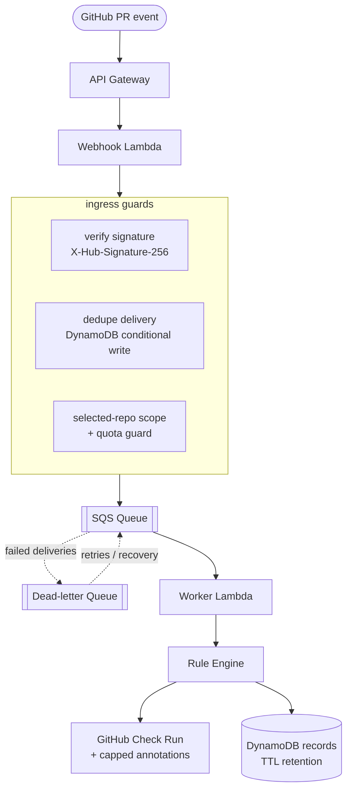

<div align="center">


### Reviews your pull request before a human has to.

*Self-hosted. Free-tier-first. Deterministic. Honest when it can't help.*


</div>

---

## What is PRPilot?

**PRPilot is a self-hosted GitHub App that posts structured feedback on a pull request *before* a human reviewer spends time on avoidable issues.**

It's built for students and early-career developers who don't have a senior engineer looking over every PR. Instead of a SaaS you send your code to, **you deploy PRPilot into your own AWS account**, connect a private GitHub App to repos *you* control, and keep full ownership of budget, logs, and retained data.

The whole thing is designed to run inside AWS free tier — the default target is **$0–$5/month per instance**, with a hard `$10` ceiling it will not silently cross.

> **Design north star:** when PRPilot can't honestly review your PR, it says so with a blocking check — it never pretends the review passed.

---

## Why it exists

| The problem | PRPilot's answer |
|-------------|------------------|
| Juniors wait hours for a first review on trivial issues | A required check posts structured feedback in **under 60s (p95)** |
| SaaS review bots want your source code and your money | Runs **in your own AWS account**, on **repos you control** |
| AI review tools rack up surprise bills | **Free-tier-first**; expensive scans are **off by default** |
| Bots that "pass" even when they choked | PRPilot **fails closed** and tells you *why* |

---

## How it works



**The contract PRPilot holds itself to:**

- **Ingress SLO** — acknowledge accepted deliveries within GitHub's **10-second** window so deliveries aren't marked failed.
- **Latency SLO** — normal PRs get a completed check in **< 60s at p95** (fast lane targets far below that).
- **Loss SLO** — an accepted delivery is **never silently dropped** between ingress and queue.
- **Cost SLO** — target **$0–$5/mo**, hard ceiling **$10/mo**; conserve mode kicks in before that.
- **Security SLO** — secrets are never hardcoded and **rotate without a redeploy**.

---

## Two lanes

PRPilot separates the review that **must always run** from the review that **costs more**.

| | **Fast lane** (`PRPilot Fast`) | **Deep lane** (`PRPilot Deep`) |
|---|---|---|
| **When** | Every supported PR, automatically | Manual button, or narrow opt-in |
| **Cost** | Free-tier cheap | Higher — off by default |
| **Blocking?** | Yes — merge-gate on critical findings | No — never affects the required lane |
| **Trigger** | `pull_request` opened/reopened/synchronize/ready | `check_run.requested_action` → *Run deep scan* |
| **Default** | **Always on** | **Manual only** |

The fast lane is **deterministic and required**. The deep lane is opt-in and can never weaken or block the required path.

---

## Supported repositories (MVP scope)

The first supported repository class is deliberately narrow:

- **Node.js / TypeScript / JavaScript** repos
- Repo root **must** contain `package.json` **and** `package-lock.json`
- Uses **GitHub Actions** for CI

> If a repo is missing those files, PRPilot marks it **unsupported for the required path** with an explicit blocking result — it does not pretend a review happened. Broader multi-language coverage is deferred until the baseline proves useful inside the cost ceiling.

---

## The usage envelope

These are **architectural caps**, not temporary tuning knobs. PRPilot degrades explicitly instead of auto-scaling past them.

| Dimension | Default target | Hard ceiling | Response when approaching |
|-----------|:--------------:|:------------:|---------------------------|
| Monthly spend / instance | $0–$5 | $10 | Enter conserve mode |
| App installations | 5 | 10 | Stop expanding scope |
| Active repos w/ reviews | 3 | 5 | Disable new enablement |
| Fast-lane jobs (global) | 20/day | 50/day | Coalesce + throttle reruns |
| Fast-lane jobs (per repo) | 10/day | 20/day | Explicit over-quota result |
| Manual reruns / PR | 2/day | 3/day | Reject with clear summary |
| Deep scans | disabled | 1/repo/day | Keep off unless requested |
| Inline annotations / run | 20 | 30 | Overflow → summary text |
| Changed files / run | 50 | 100 | Explicit oversized-run result |

---

## Policy precedence

Configuration is layered, and **safety always wins**:

1. **Safety invariants** — signature verification, dedupe, required-path honesty, hard caps. *Nothing* can weaken these.
2. **Deployment-owner runtime policy** (AWS Parameter Store) — budget mode, selected-repo scope, quotas, emergency disables. Changes take effect **without a redeploy**.
3. **Repository policy** (`.prpilot.yml`) — may *narrow* scope or *raise* strictness, but can never exceed owner caps or disable required security behavior.
4. **Environment defaults** — baseline limits when nothing above overrides them.

`budget_mode` is one of `normal | conserve | emergency`. If the owner policy can't be loaded or validated, the required path **fails closed** rather than guessing.

---

## Getting started

### Prerequisites

- Node.js **22 LTS** and npm **10+**
- An AWS account (free-tier eligible)
- AWS CLI configured (profile or SSO)
- Permission to create a **private GitHub App**

### 1. Prove it locally first

```bash
npm install
npm run typecheck
npm run lint
npm test
npm run infra:synth
```

### 2. Provision the required live inputs

Store these — **secrets go in Parameter Store, never in code**:

- GitHub App ID
- GitHub webhook secret
- GitHub App private key
- Runtime policy JSON
- One selected repository ID
- AWS region

### 3. Deploy

The CDK stack provisions: **API Gateway, webhook Lambda, worker Lambda, SQS queue, DLQ, DynamoDB table, log groups, and alarms.**

```bash
cdk deploy
```

Copy the `WebhookUrl` output into your GitHub App's webhook settings, then open a test PR in the selected repo.

Full walkthrough: [`docs/self-host-quickstart.md`](docs/self-host-quickstart.md) and [`docs/github-app-and-aws-setup.md`](docs/github-app-and-aws-setup.md).

---

## Optional: the preflight CLI

Catch issues locally *before* you push, so your deployed usage stays low:

```bash
npm run preflight
```

Runs the same deterministic fast-lane checks against your working tree — cheapest review is the one that never hits the cloud.

---

## Project layout

```
apps/
  webhook/          API Gateway → signature verify, dedupe, scope/quota guard, enqueue
  worker/           SQS consumer → runs the rule engine, publishes the check
  cli/              local preflight command

packages/
  rules/            deterministic fast-lane + deep-lane rule engine
  checks/           GitHub Check Run payloads, annotations, conclusions
  queue/            review queue, lane admission, rerun throttling, freshness
  review-store/     DynamoDB persistence, retention/TTL, recovery drill
  github/           installation authorization
  deployment/       deployment validation
  observability/    free-tier-aware observability
  config/           runtime policy schema + loader

infra/              AWS CDK app (PRPilotStack)
tests/              unit + integration suites
docs/               setup, security, reliability, cost, and runbook docs
```

---

## Documentation

| Topic | Doc |
|-------|-----|
| Self-host quickstart | [`docs/self-host-quickstart.md`](docs/self-host-quickstart.md) |
| GitHub App + AWS setup | [`docs/github-app-and-aws-setup.md`](docs/github-app-and-aws-setup.md) |
| Security architecture | [`docs/security-architecture.md`](docs/security-architecture.md) |
| Reliability architecture | [`docs/reliability-architecture.md`](docs/reliability-architecture.md) |
| Cost control | [`docs/cost-control.md`](docs/cost-control.md) |
| Secret rotation | [`docs/secret-rotation.md`](docs/secret-rotation.md) |
| Operations runbook | [`docs/operations-runbook.md`](docs/operations-runbook.md) |
| Recovery drill | [`docs/recovery-drill.md`](docs/recovery-drill.md) |
| Five-minute demo | [`docs/five-minute-demo.md`](docs/five-minute-demo.md) |

---

## Development

```bash
npm run webhook:dev          # local webhook dev server
npm test                     # vitest unit + integration
npm run lint                 # eslint
npm run typecheck            # tsc --noEmit
npm run ci:latency           # check latency baseline
npm run ci:deterministic     # verify the required path stays deterministic
```

---

## Design principles

- **Honest over helpful** — a blocking "I can't review this" beats a false pass.
- **Free-tier-first** — cost is a feature; expensive work is opt-in and capped.
- **Deterministic required path** — the same PR yields the same required result.
- **Self-hosted ownership** — your account, your data, your budget, your logs.
- **Degrade explicitly** — near a ceiling, reduce detail or defer; never silently drop work.

---

<div align="center">

**PRPilot** — the review that runs before the reviewer.

Built by [Priyan Arora](https://github.com/PriyanArora) · Licensed under [MIT](LICENSE)

</div>
